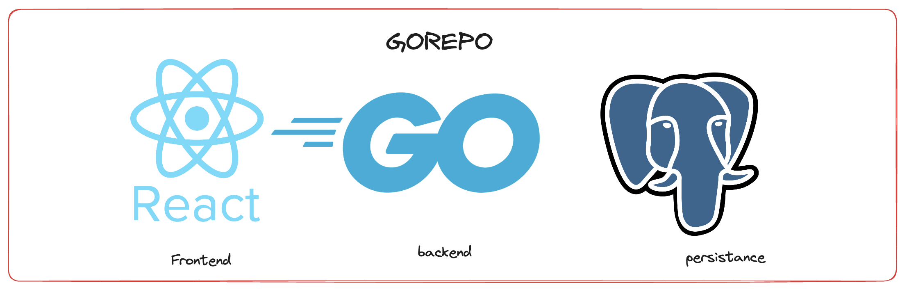
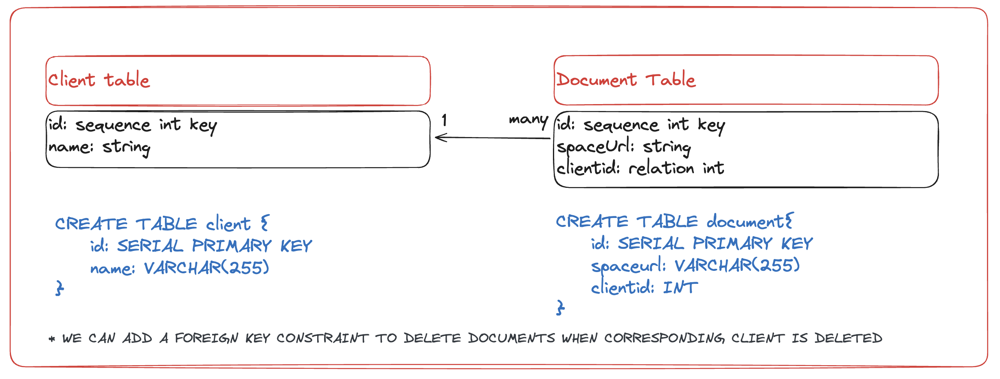
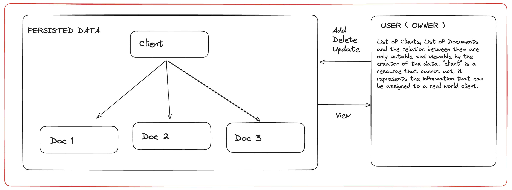
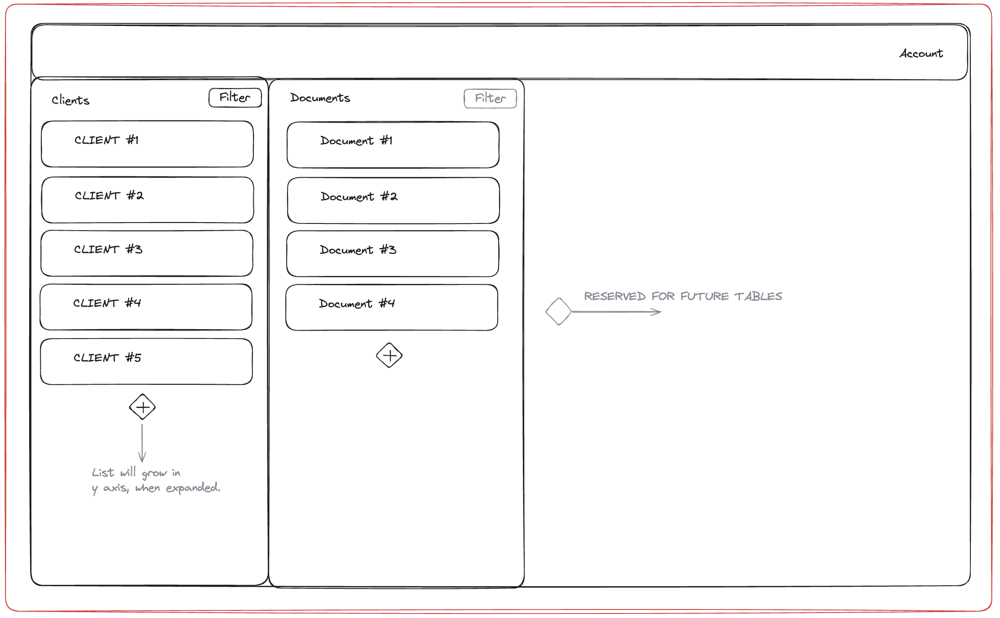
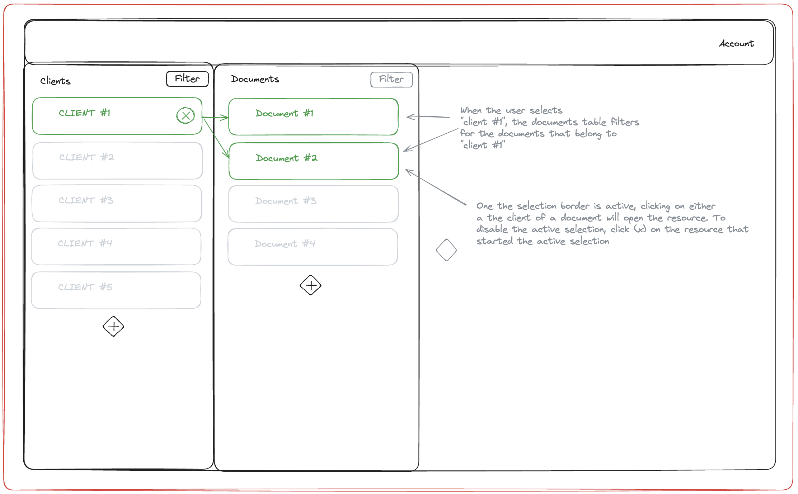
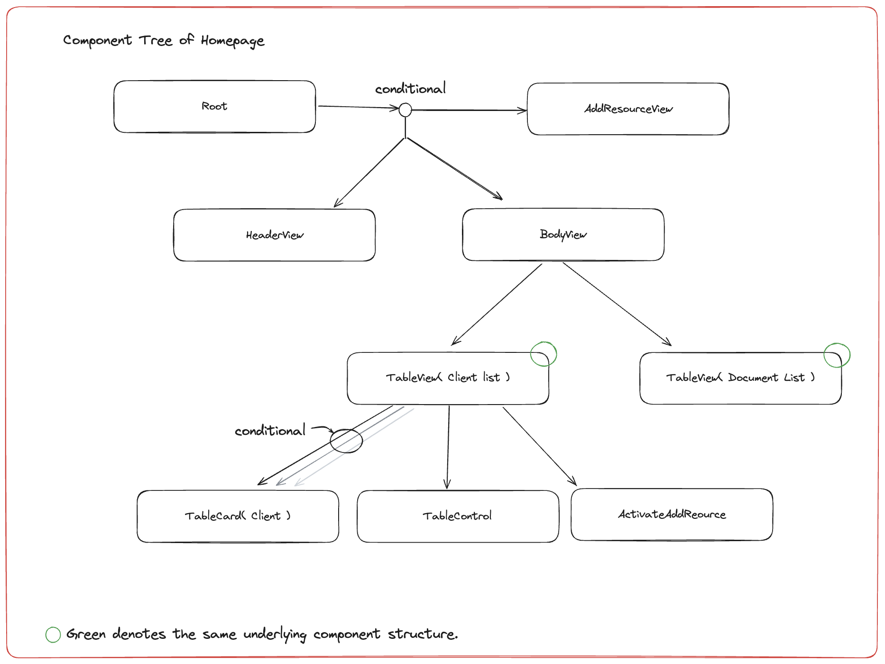

# What is Verotemp?
``` this is the same README as the backend for the project```

___
Verotemp is a quick templating system for generating repetative documents. An example usecase is generating 100 party invitaions from a csv file of guest. This project was originally developed in a previous position i held at my parent's electrial contracting practice. The repository was stored locally, so i will rebuild the webapp for the enjoyment of whoever comes accross this project. 
In addition to bulk document generation, the web app performs the following functions. 
- Maintaining client list
- Maintaining Document list
- storing documents in the cloud
- Relationship mapping between clients and documents

## Technology stack

This project will be using the "GOREPO" stack. It stands for React-Goland-Postgres. I find React to be the best library ( feels like a framework ) for creating web user-interfaces. It is a component based tool that is non-opinionated. This means we can create composable peices of UI and we arent constraint to a rule set. 

The backend will be developed in Go using the Gin framework. I previosly used Ruby on Rails for my backend and API development; however, i felt that the increased productivity did not make up for the dependancy issues and the high level nature. Go provides a dependable package manager and forces a simpler development style. I also find forces error checking to be a hugh benefit.


Since this app revolves around the relation between objects, we will use a relational db for persisting app data. I chose Postgres. The primary motivation is that there is a free hosting service for it which i frequently use.



I felt that it was more important to emphasis Go in the stack since the https framework we will use, Gin, is very similar to other Goland Https framworks. Apart from these three tools, we will be deploying on Digital ocean, using vite as the build tool for the React app, using Tailwinds for the frontend styling, and more that i will explain later on.


## Frontend overview





